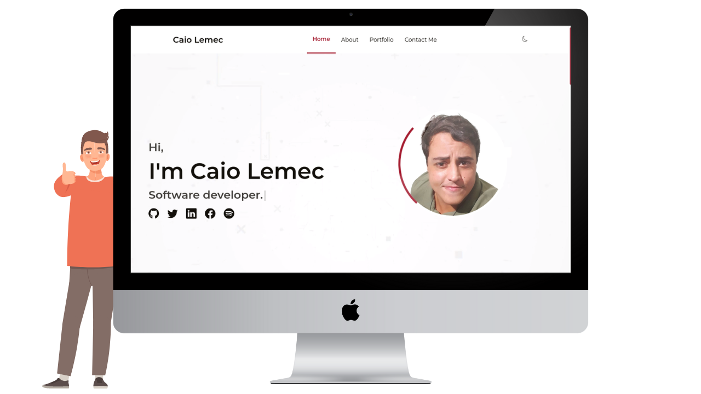

<h1 align="center">
    My Portfolio 1.0
</h1>
<br>
<p align="center">
  <a href="#desktop_computer-project"></a>&nbsp;
  <a href="#nail_care-layout"></a>&nbsp;
  <a href="#technologist-technologies"></a>
  <a href="#octocat-environment"></a>&nbsp;
  <a href="#bookmark_tabs-license"></a>&nbsp;
</p>

<p align="center">
 
</p>
<hr>

## :desktop_computer: Project

The purpose of creating <Strong>My Portfolio 1.0v</Strong> is to challenge myself and put knowledge in frontend into practice.

I am among those who adhere to the belief that learning can only be achieved through practice. Therefore, I endeavored to utilize multiple features in this project and, as a result, gained a wealth of knowledge regarding React, Typescript, and Styled-components.

My intention was to craft a unique and exceptional webpage, which I designed and developed independently, without assistance from more seasoned professionals. Consequently, if you observe any areas within my code that could be enhanced, I would greatly appreciate your input. I view all feedback as an opportunity to refine my skills, and I eagerly anticipate any pull requests or messages from you.💌

>`Alert 1:` Due to some features in the styling, it is not recommended use olders browsers.

>`Alert 2:` I'm still making improvements to responsiveness, if you have any suggestions, please get in touch.

## :nail_care: Layout
<p align="center">


</p>
<p align="center">You can also check <a href="https://www.caiolemec.com.br" target="_blank" rel="noreferrer">Deploy</a>.</p>
<hr>

## :technologist: Technologies

- [React](https://pt-br.reactjs.org/)
- [Typescript](https://www.typescriptlang.org/)
- [React 3d Hover](https://www.npmjs.com/package/react-3d-hover)
- [React Hook Form](https://react-hook-form.com/)
- [TypeWriter](https://www.npmjs.com/package/typewriter-effect)
- [React Icons](https://react-icons.github.io/react-icons/)
- [React Leaflet](https://react-leaflet.js.org/)
- [Yup](https://www.npmjs.com/package/yup)
- [EmailJS](https://www.emailjs.com/)
- [AOS](https://michalsnik.github.io/aos/)

<hr>

## :octocat: Environment

Keep in mind that the following installations will be needed:

- [Git](https://git-scm.com/book/pt-br/v2/Come%C3%A7ando-Instalando-o-Git)
- [Yarn](https://classic.yarnpkg.com/en/docs/install/#debian-stable)

Follow the instructions to run the application:

1. Clone the repository: 
```bash 
git@github.com:CaioLemec/portfolio.git
```
2. Install all dependencies by using command:
```bash
yarn
```
3. In the project root, find and rename .env.local.exemple to .env.local following inside instructions:
```bash
Follow the instructions inside to fill the environment variables.
```
4. Open anoter terminal and set this command line:
```bash
yarn dev
```
5. Access the generated address in your browser:
```bash
http://localhost:3000/
```
<hr>

## :bookmark_tabs: License

Licensed under MIT [LICENSE](./LICENSE.md).

<hr>

I am available for any clarification. 
    

<h3>Caio Lemec<h3>
<a href="https://t.me/caiolemec">
<a href="mailto:caiolemec@gmail.com">
<a href="https://www.linkedin.com/in/caiolemec/">
<br>
</p>
